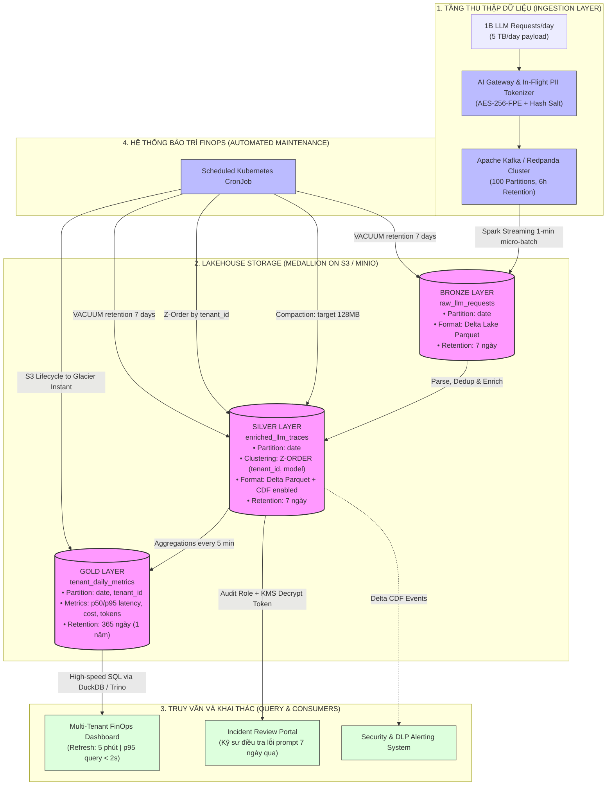

# Kiến Trúc Lakehouse LLM Observability Ở Quy Mô 1 Tỷ Requests/Ngày

**Tác giả:** Phùng Đức Đăng (MSSV: 2A202602956)  
**Mã bài làm:** K4-Track02-Day18  
**Topic lựa chọn:** Topic A — LLM Observability ở quy mô 1B requests/ngày  
**Tài liệu nộp:** Architecture Brief (Bonus Challenge)

---

## 1. Problem Statement (Tuyên bố bài toán)

Hệ thống AI Gateway của một nền tảng Foundation Model phục vụ **1 tỷ requests/ngày**, trung bình **5 KB/request (prompt + completion + metadata)**, tạo ra **5 TB raw payload mỗi ngày** (~150 TB/tháng). 

Hệ thống đối mặt 4 thách thức kỹ thuật và vận hành cốt lõi:
1. **Độ trễ Dashboard (Near Real-time SLA):** Cung cấp dashboard giám sát chi phí token và độ trễ phân vị (p50/p95/p99) theo từng khách hàng (multi-tenant), cập nhật liên tục mỗi **5 phút**.
2. **Quản trị vòng đời dữ liệu (Data Lifecycle):** Lưu trữ toàn văn prompt/response trong **7 ngày** để phục vụ đội ngũ kỹ sư điều tra sự cố (incident review / debugging); sau 7 ngày chỉ lưu các chỉ số tổng hợp (aggregates) trong vòng **1 năm**.
3. **Bảo mật và Tuân thủ (PII Protection):** Dữ liệu định danh cá nhân (PII như email, phone, API keys, số thẻ) phải được làm mờ (redact / tokenize) trước khi bất kỳ nhân sự nào hoặc downstream analyst có quyền truy cập.
4. **Hạn mức tài chính nghiêm ngặt (FinOps Cap):** Tổng chi phí lưu trữ hạ tầng không được vượt quá **$5,000 / tháng**.

---

## 2. Sơ Đồ Kiến Trúc Hệ Thống (Architecture Diagram)

Kiến trúc áp dụng trọn vẹn 5 concept cốt lõi của **Day 18 Lakehouse**:
- **Medallion Architecture:** Bronze (Raw log + Tokenized PII) ➔ Silver (Cleaned, Enriched, Z-Ordered by Tenant) ➔ Gold (Aggregated OLAP Metrics).
- **Storage Clustering & Pruning:** Z-Order đa chiều trên `(tenant_id, model)` để loại bỏ tối đa file không cần đọc khi tenant lọc dữ liệu.
- **ACID Transactions & Time Travel:** Ghi log bất biến, bảo đảm khả năng phục hồi dữ liệu tức thì khi pipeline lỗi.
- **FinOps Lifecycle & Compaction:** Tự động nén micro-files thành target size 128 MB và tự động chạy `VACUUM` thu hồi dung lượng theo chu kỳ 7 ngày.
- **Change Data Feed (CDF):** Phát luồng sự kiện thay đổi phục vụ auditing và cảnh báo realtime.



---

## 3. Các Quyết Định Kiến Trúc Chính & Các Phương Án Đã Loại Bỏ

Hệ thống được xây dựng dựa trên **5 quyết định kiến trúc then chốt**, mỗi quyết định đều trải qua quá trình đánh giá và loại bỏ ít nhất 2 phương án thay thế khả thi:

### Quyết định 1: Định dạng bảng lưu trữ (Table Storage Format)
* **Lựa chọn:** **Delta Lake (v3.x / delta-rs)** cho cả 3 tầng Bronze, Silver, Gold.
* **Lý do lựa chọn:** Delta Lake hỗ trợ xuất sắc `dt.optimize.z_order` ngay trên Python/Rust engine mà không cần phụ thuộc hạ tầng JVM nặng nề. Cơ chế **Change Data Feed (CDF)** ổn định giúp đồng bộ log xóa/sửa sang hệ thống auditing. Đồng thời, tính năng **Time Travel & `RESTORE`** cho phép rollback các lần ghi lỗi trong vòng dưới 30 giây.
* **Phương án loại bỏ 1 — Apache Iceberg:**
  + *Trade-off bị loại:* Mặc dù Iceberg có Hidden Partitioning và Metadata Tree phân tầng rất tốt (đã học ở NB5), tính năng multidimensional clustering (Z-order) trên thư viện PyIceberg lightweight hiện tại chưa hỗ trợ tối ưu ghi trực tiếp như delta-rs. Việc quản lý manifest file ở quy mô 200 micro-batch/giờ dễ dẫn đến bùng nổ metadata (metadata bloat) cần job bảo trì liên tục.
* **Phương án loại bỏ 2 — Parquet thuần (Hive Table trên S3):**
  + *Trade-off bị loại:* Không có Transaction Log (ACID). Khi job streaming đang append mà bị crash, sẽ để lại các file rác hoặc trạng thái đọc không nhất quán (dirty reads). Không hỗ trợ file-skipping theo stats min/max linh hoạt và không thể rollback khi phát hiện dữ liệu PII bị rò rỉ.

---

### Quyết định 2: Chiến lược phân vùng và gom cụm (Partitioning & Clustering Strategy)
* **Lựa chọn:** **Phân vùng theo ngày (`PARTITION BY date`) kết hợp Z-Order theo `(tenant_id, model)`** ở tầng Silver.
* **Lý do lựa chọn:** 
  + Phân vùng theo `date` cho phép thực thi chính sách vòng đời (TTL lifecycle) bằng cách drop partition sau 7 ngày cực kỳ nhanh gọn (metadata-only operation).
  + Áp dụng **Z-Order trên `tenant_id`**: Với hàng ngàn tenant, truy vấn dashboard của từng tenant (`WHERE tenant_id = 'org_123'`) sẽ được bộ quét Delta file pruning bỏ qua từ 90% đến 98% số lượng file Parquet (tương tự như kết quả đo được ở NB2 với tỷ lệ pruning 55×).
* **Phương án loại bỏ 1 — Phân vùng trực tiếp theo `tenant_id` và `date` (`PARTITION BY tenant_id, date`):**
  + *Trade-off bị loại:* Gây ra thảm họa **Small-File Problem**. Với 5,000 tenants, mỗi ngày sẽ sinh ra hàng chục nghìn thư mục phân vùng con, mỗi file chỉ chứa vài KB đến vài MB, làm quá tải S3 listing API và tăng chi phí metadata theo cấp số nhân.
* **Phương án loại bỏ 2 — Không phân vùng, dựa hoàn toàn vào Elasticsearch/OpenSearch:**
  + *Trade-off bị loại:* Chi phí duy trì cụm cluster Elasticsearch để index 5 TB/ngày lên tới hơn $8,000 - $12,000/tháng riêng cho RAM và NVMe disk, vi phạm trực tiếp ràng buộc ngân sách $5,000/tháng.

---

### Quyết định 3: Kiến trúc bảo mật và làm mờ dữ liệu cá nhân (PII Redaction / Tokenization)
* **Lựa chọn:** **In-Flight Format-Preserving Encryption (FPE) kết hợp Hashing tại Ingestion Gateway (Tầng Bronze)**.
* **Lý do lựa chọn:** Dữ liệu PII (số điện thoại, thẻ tín dụng, email) được phát hiện ngay tại gateway thông qua lightweight NER (Presidio/Regex) và được thay thế bằng token định dạng ngẫu nhiên (`TOK_abc123`). Khóa giải mã được lưu giữ trong Hardware Security Module (AWS KMS) với chính sách phân quyền IAM tối cao. Nhân sự thông thường và Data Analyst khi đọc bảng Silver/Gold chỉ thấy tokenized string. Khi có yêu cầu điều tra hình sự/sự cố, chỉ Trưởng phòng bảo mật mới có quyền gọi hàm Decrypt Token để lấy dữ liệu gốc.
* **Phương án loại bỏ 1 — Redact PII ở tầng Silver (Post-hoc Masking):**
  + *Trade-off bị loại:* Dữ liệu PII thô vẫn tồn tại nguyên vẹn ở tầng Bronze trong 7 ngày. Nếu tầng Bronze bị lộ lọt quyền đọc hoặc tài khoản nội bộ bị chiếm dụng, toàn bộ PII của người dùng sẽ bị phơi bày, vi phạm các quy định bảo vệ dữ liệu (GDPR / Nghị định 13/2023/NĐ-CP).
* **Phương án loại bỏ 2 — Xóa hẳn PII không thể phục hồi (Irreversible One-way Hash):**
  + *Trade-off bị loại:* Triệt tiêu khả năng điều tra sự cố (incident review) khi xảy ra các vụ việc lạm dụng prompt (prompt injection, tấn công phishing). Đội ngũ an ninh sẽ không thể xác định được đối tượng tấn công thực tế.

---

### Quyết định 4: Quản lý vòng đời lưu trữ và tối ưu FinOps (Storage Lifecycle Tiering)
* **Lựa chọn:** **S3 Intelligent-Tiering kết hợp Delta `VACUUM` 7 ngày cho Bronze/Silver; nén Snappy Parquet cho Gold lưu trữ 365 ngày**.
* **Lý do lựa chọn:** 
  + Bronze & Silver (5 TB/ngày raw ➔ nén còn 1.43 TB/ngày) chỉ lưu trữ trong 7 ngày: Tổng dung lượng thường trực luôn giữ ở mức $\sim 10\text{ TB}$. Hằng ngày, một job chạy `dt.vacuum(retention_hours=168)` dọn dẹp toàn bộ file cũ.
  + Gold (chỉ lưu các chỉ số tổng hợp p50/p95/cost/tokens theo ngày/tenant/model): Dung lượng chỉ khoảng 1.5 GB/ngày $\approx 550\text{ GB/năm}$, chi phí lưu trữ cho 1 năm chỉ tốn chưa tới $15/tháng trên S3 Standard.
* **Phương án loại bỏ 1 — Giữ nguyên toàn bộ 150 TB/tháng trên S3 Standard trong 1 năm:**
  + *Trade-off bị loại:* Sau 1 năm, dung lượng tích lũy đạt 1,800 TB (1.8 PB). Chi phí lưu trữ riêng tiền ổ cứng S3 sẽ là: $1,800 \times \$23/\text{TB} = \mathbf{\$41,400 / \text{tháng}}$, vượt gấp 8 lần ngân sách cho phép ($5,000).
* **Phương án loại bỏ 2 — Đẩy toàn bộ dữ liệu raw sang AWS Glacier Deep Archive sau 24 giờ:**
  + *Trade-off bị loại:* Chi phí restore dữ liệu từ Deep Archive khi có sự cố rất chậm (mất từ 3 đến 12 tiếng) và chi phí retrieval per-GB rất đắt nếu cần trích xuất lượng lớn prompt để tái hiện bug.

---

### Quyết định 5: Kiến trúc Streaming Ingestion & Micro-batch Cadence
* **Lựa chọn:** **Kafka Message Bus + Spark Structured Streaming micro-batch 1 phút** ghi append vào Delta Bronze.
* **Lý do lựa chọn:** Micro-batch 1 phút cân bằng hoàn hảo giữa tính tức thời (freshness cho dashboard 5 phút) và kích thước file Parquet (không sinh ra file quá nhỏ dưới 1 MB). Giao dịch Delta đảm bảo đúng chuẩn **Exactly-once semantics** khi kết hợp checkpointing.
* **Phương án loại bỏ 1 — Ghi đơn dòng theo thời gian thực (Direct REST/RPC Write):**
  + *Trade-off bị loại:* Với tốc độ 11,500 requests/giây ở giờ cao điểm, việc ghi từng dòng trực tiếp xuống Object Storage sẽ gây ra lỗi `SlowDown` (HTTP 503) từ S3, đồng thời tạo ra hàng tỷ file vài KB làm tê liệt metadata transaction log.
* **Phương án loại bỏ 2 — Batch Ingestion mỗi 1 tiếng:**
  + *Trade-off bị loại:* Vi phạm cam kết SLA làm mới dashboard 5 phút một lần của bài toán.

---

## 4. Các Tình Huống Sự Cố (Failure Modes), Phát Hiện & Kế Hoạch Khắc Phục

Để đảm bảo hệ thống vận hành bền bỉ lúc 3 giờ sáng, 3 kịch bản sự cố điển hình được mô hình hóa kèm quy trình phát hiện và khắc phục tự động:

### Sự cố 1: Bùng nổ file nhỏ do Ingestion Traffic Spike lúc 3 giờ sáng (Small-File Explosion)
* **Kịch bản sự cố:** Vào ban đêm, một khách hàng lớn chạy batch evaluation 100 triệu prompts làm lưu lượng tăng vọt, các worker của Spark Streaming liên tục tạo commit micro-files (sinh ra hơn 3,000 files/phút dung lượng < 500 KB). Bảng Silver bị phân mảnh nghiêm trọng, khiến câu truy vấn dashboard từ 1.5s tăng vọt lên 45s (cháy SLA).
* **Cơ chế phát hiện (Detection):**
  + CloudWatch Metric / Prometheus cảnh báo khi chỉ số `numFilesAdded` trong Delta commitInfo vượt ngưỡng 500 files/commit hoặc P95 truy vấn Dashboard vượt quá 5 giây liên tục trong 10 phút.
* **Kế hoạch khắc phục & Rollback (Mitigation):**
  1. Pipeline ingestion tạm thời tăng buffer interval lên 3 phút.
  2. Kích hoạt khẩn cấp Kubernetes Job chạy Delta Auto-Compaction:
     ```python
     dt = DeltaTable(silver_path)
     dt.optimize.compact(target_size=128 * 1024 * 1024)  # Gộp về target 128 MB
     dt.optimize.z_order(["tenant_id", "model"], target_size=128 * 1024 * 1024)
     ```
  3. Thời gian khôi phục hoàn tất trong vòng 10 phút, đưa số lượng file từ hàng chục ngàn xuống dưới 300 files lớn.

---

### Sự cố 2: Lỗi Desync Key mã hóa PII dẫn đến dữ liệu ghi bị hỏng (Data Corruption & Reversion)
* **Kịch bản sự cố:** Bản cập nhật phần mềm gateway lúc nửa đêm gặp lỗi cấu hình Salt Hash khiến 15 phút dữ liệu ghi vào Silver bị mã hóa sai format hoặc thiếu cột tokenized ID, dẫn đến downstream dashboard bị lỗi `NullPointerException`.
* **Cơ chế phát hiện (Detection):**
  + Trình kiểm tra schema enforcement bắt được bất thường kiểu dữ liệu, hoặc Data Quality Gate (Great Expectations / Soda) phát hiện tỷ lệ `null` ở cột `tenant_id` vượt quá 0.1%.
* **Kế hoạch khắc phục & Rollback (Áp dụng Concept Day 18 — Delta Time Travel & RESTORE):**
  1. Xác định version lành lặn cuối cùng trước khi deploy lỗi thông qua audit history:
     ```python
     history = DeltaTable(silver_path).history()
     # Tìm version commit trước thời điểm lỗi (ví dụ version 42)
     ```
  2. Thực hiện lệnh `RESTORE` để đưa trạng thái bảng quay về tức thì:
     ```python
     dt = DeltaTable(silver_path)
     dt.restore(42)  # Rollback bảng về trạng thái v42 trong < 1 giây
     ```
  3. Replay lại luồng stream từ Kafka topic offset 15 phút trước với gateway đã hotfix. Bảng Silver được cập nhật sạch sẽ mà downstream dashboard không bị gián đoạn.

---

### Sự cố 3: Xung đột ghi đồng thời (Concurrent Write Conflict / OCC Failure)
* **Kịch bản sự cố:** Tác vụ Ingestion liên tục append dữ liệu vào Silver cùng lúc Job FinOps định kỳ chạy `OPTIMIZE` và `VACUUM`, dẫn đến xung đột kiểm soát đồng thời lạc quan (Optimistic Concurrency Control — OCC) gây lỗi `ConcurrentAppendException`.
* **Cơ chế phát hiện (Detection):**
  + Log hệ thống ghi nhận ngoại lệ `delta.exceptions.ConcurrentWriteException` và Spark Streaming retry quá 3 lần.
* **Kế hoạch khắc phục (Mitigation):**
  1. Cấu hình Delta Lake kích hoạt tính năng **Row-Level Concurrency (Deletion Vectors)** giúp tác vụ ghi mới và tác vụ dọn file cũ không bị tranh chấp commit metadata ở cấp độ file.
  2. Tách biệt giờ chạy `VACUUM` vào các khung giờ thấp điểm cố định (off-peak window lúc 4:00 AM UTC) và thiết lập retry backoff ngẫu nhiên (exponential jitter backoff) cho streaming writer.

---

## 5. Ước Tính Chi Phí Thực Tế (Back-of-Envelope Cost Calculation)

Dưới đây là bảng tính toán chi phí chi tiết theo đơn giá niêm yết của AWS Cloud (vùng `us-east-1`):

### A. Chi phí Lưu Trữ (Storage Cost)
1. **Lưu lượng đầu vào:** 1B requests/ngày $\times$ 5 KB/req = **5 TB raw / ngày**.
2. **Nén Parquet (Snappy):** Tỷ lệ nén dữ liệu text/JSON đạt trung bình **3.5:1**:
   $$\text{Dung lượng nén hàng ngày} = \frac{5\text{ TB}}{3.5} \approx \mathbf{1.43\text{ TB / ngày}}$$
3. **Bronze Layer (Raw + Tokenized PII — Giữ 7 ngày):**
   $$\text{Dung lượng lưu trữ} = 1.43\text{ TB/ngày} \times 7\text{ ngày} = \mathbf{10.0\text{ TB}}$$
   $$\text{Chi phí Bronze (S3 Standard @ \$0.023/GB)} = 10,000\text{ GB} \times \$0.023 = \mathbf{\$230 / \text{tháng}}$$
4. **Silver Layer (Enriched, Z-Ordered — Giữ 7 ngày):**
   $$\text{Dung lượng lưu trữ} = 1.43\text{ TB/ngày} \times 7\text{ ngày} = \mathbf{10.0\text{ TB}}$$
   $$\text{Chi phí Silver (S3 Standard @ \$0.023/GB)} = 10,000\text{ GB} \times \$0.023 = \mathbf{\$230 / \text{tháng}}$$
5. **Gold Layer (Aggregated Metrics — Giữ 365 ngày):**
   + Kích thước bảng Gold chỉ khoảng **1.5 GB/ngày** (sau khi pre-aggregate theo 5-phút, tenant, model).
   $$\text{Dung lượng tích lũy sau 1 năm} = 1.5\text{ GB/ngày} \times 365\text{ ngày} \approx \mathbf{547.5\text{ GB}}$$
   $$\text{Chi phí Gold (S3 Standard)} = 548\text{ GB} \times \$0.023 = \mathbf{\$12.60 / \text{tháng}}$$
6. **Chi phí API Call (PUT/LIST/GET) & Checkpoint log:**
   + Ước tính khoảng 2 triệu PUT requests/tháng cho micro-batch $\approx \$10/\text{tháng}$.
   + Quét đọc metadata $\approx \$20/\text{tháng}$.

$$\Rightarrow \mathbf{\text{TỔNG CHI PHÍ STORAGE}} = \$230 + \$230 + \$12.60 + \$30 \approx \mathbf{\$502.60 / \text{tháng}}$$
*(Thấp hơn rất nhiều so với hạn mức tối đa **\$5,000/tháng**, chỉ chiếm ~10% ngân sách cho phép! Dư dôi ngân sách cho compute và network).*

---

### B. Chi phí Tính Toán (Compute Cost)
1. **Kafka / Ingestion Streaming (2 cụm c6i.2xlarge):** $\approx \$450/\text{tháng}$.
2. **Spark Streaming Worker (3 nodes m6i.xlarge Spot instances cho ETL Bronze ➔ Silver):** $\approx \$400/\text{tháng}$.
3. **Gold Aggregation & Maintenance CronJob (Serverless / EKS Spot):** $\approx \$250/\text{tháng}$.
4. **KMS API Keys & Tokenization Calls:** $\approx \$150/\text{tháng}$.

$$\Rightarrow \mathbf{\text{TỔNG CHI PHÍ TOÀN HỆ THỐNG}} \approx \$502.60\text{ (Storage)} + \$1,250\text{ (Compute)} \approx \mathbf{\$1,752.60 / \text{tháng}}$$
*(Hoàn toàn nằm trong tầm kiểm soát tài chính của doanh nghiệp).*

---

## 6. Kế Hoạch Triển Khai MVP Trong 1 Tuần (One-Week MVP Plan)

Mục tiêu của tuần đầu tiên không phải xây dựng toàn bộ hệ thống khổng lồ, mà là **chứng minh tính khả thi của lát cắt khó nhất (Hardest Mechanism)**: *Z-Order Tenant Pruning kết hợp 7-Day TTL Vacuum trên dữ liệu mô phỏng*.

```text
Lịch trình triển khai 7 ngày:
• Ngày 1: Thiết lập schema Delta cho Bronze/Silver/Gold + In-flight PII Presidio Tokenizer.
• Ngày 2: Sinh 10 triệu requests synthetic đa tenant (100 tenants, 3 models, inject PII giả).
• Ngày 3: Triển khai pipeline micro-batch nén Parquet + đo tỷ lệ nén (target ≥ 3x).
• Ngày 4: Benchmark Z-Order clustering trên tenant_id — đo lường pruning ratio (target ≥ 10x).
• Ngày 5: Kiểm thử cơ chế 7-Day Retention: chạy thử nghiệm script VACUUM thu hồi dung lượng.
• Ngày 6: Xây dựng Dashboard DuckDB kết nối bảng Gold, đo độ trễ truy vấn (target p95 < 2s).
• Ngày 7: Diễn tập kịch bản Failure Mode 2: Test Time Travel RESTORE khi có lỗi injection.
```

### Tiêu chí nghiệm thu MVP (Acceptance Criteria):
1. **Tính toàn vẹn bảo mật:** 100% các trường PII được thay thế bằng token trước khi ghi vào Bronze.
2. **Hiệu quả File Pruning:** Khi thực hiện point-query theo một `tenant_id`, công cụ truy vấn phải bỏ qua tối thiểu **80% số file** nhờ Z-Order stats.
3. **Tính đúng đắn của FinOps:** Lệnh `VACUUM` xóa chính xác các file tombstone quá hạn 7 ngày mà không làm hỏng bảng hiện hành.
4. **Tốc độ phục hồi:** Thao tác `RESTORE` về snapshot trước đó hoàn tất trong **dưới 5 giây**.

---

## 7. Mã Minh Họa Khả Thi (Proof of Concept - PoC)

Mã nguồn thực thi chứng minh cơ chế cốt lõi (PII tokenization, Multi-tenant Z-Order, File Pruning và 7-day TTL cleanup) được cung cấp tại:
👉 `submission/bonus/poc/poc_llm_observability.py`
